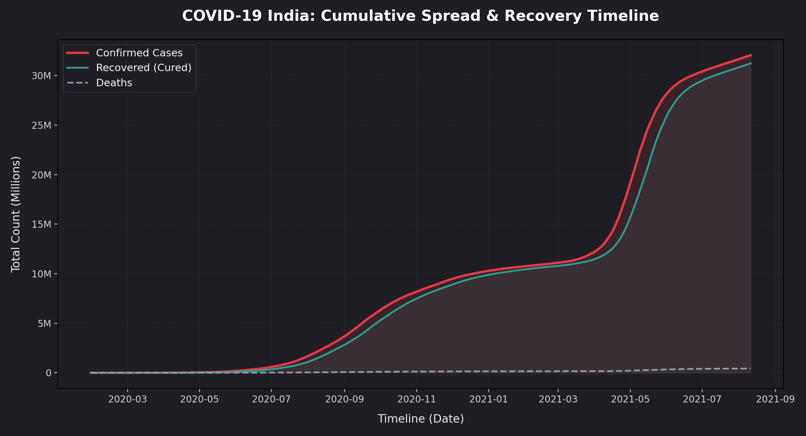
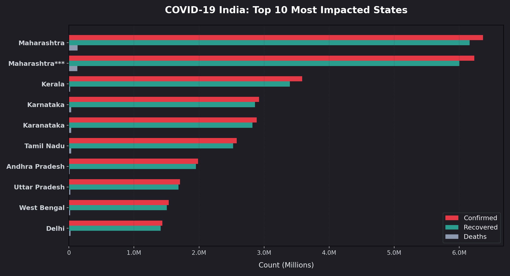
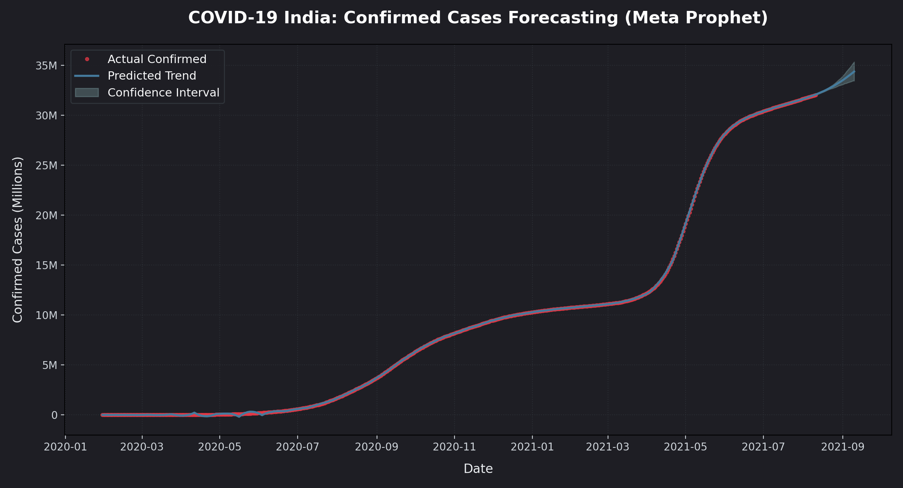
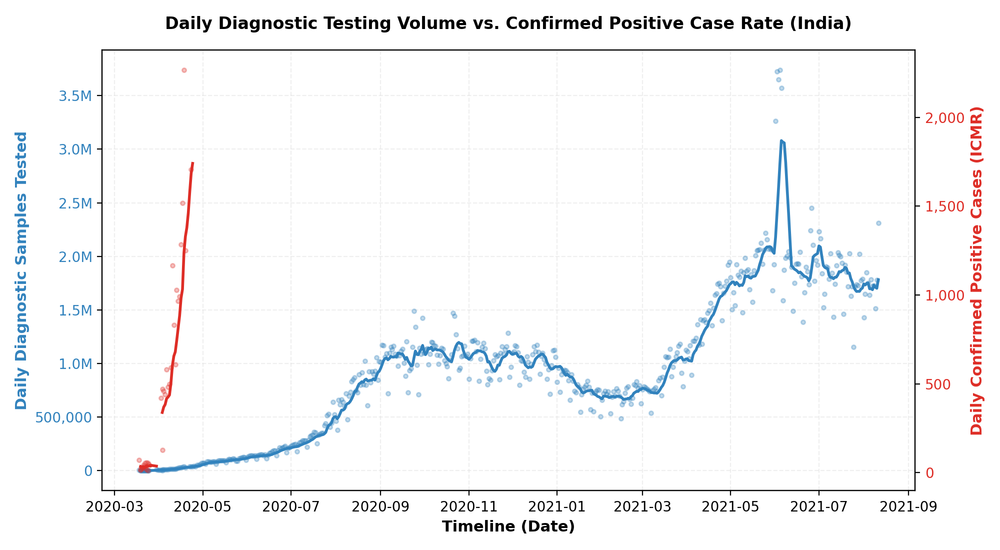
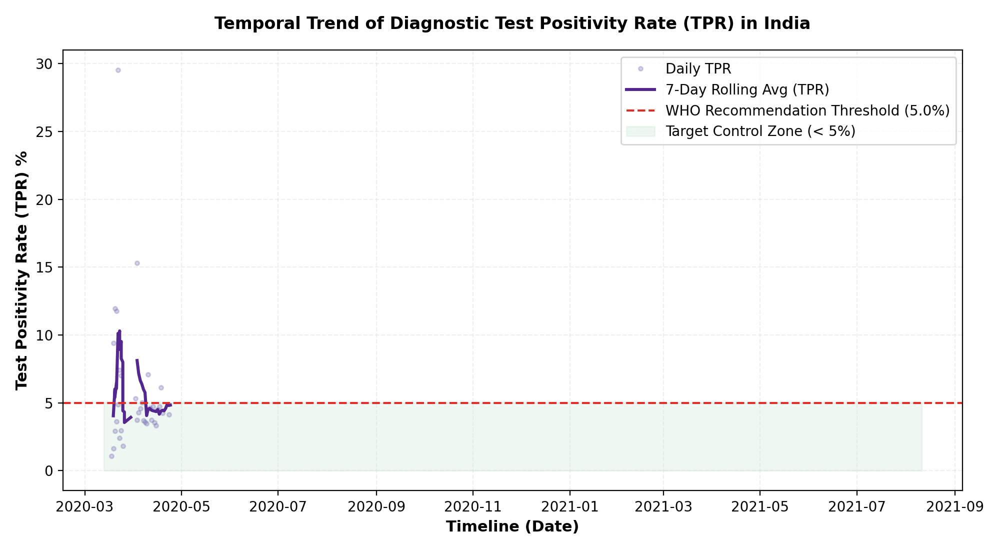
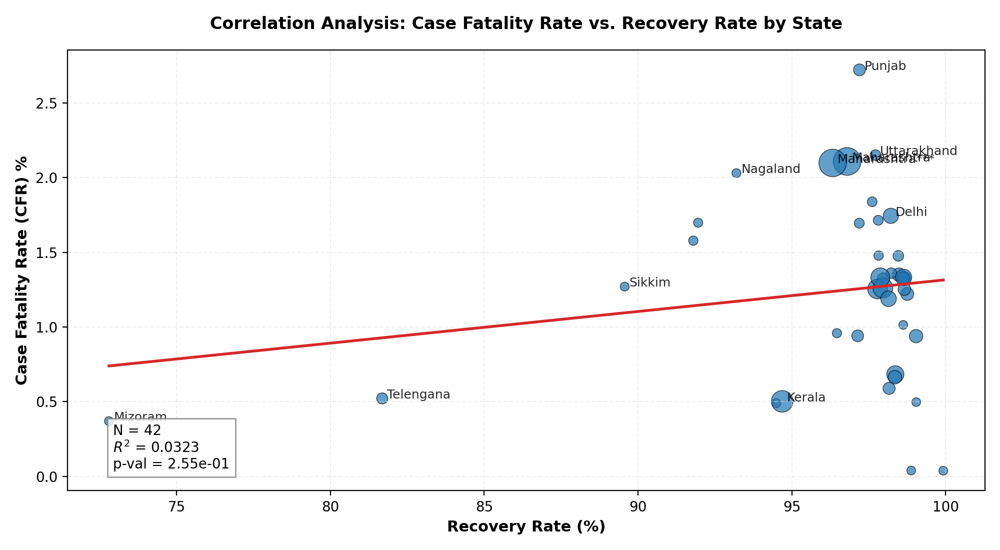
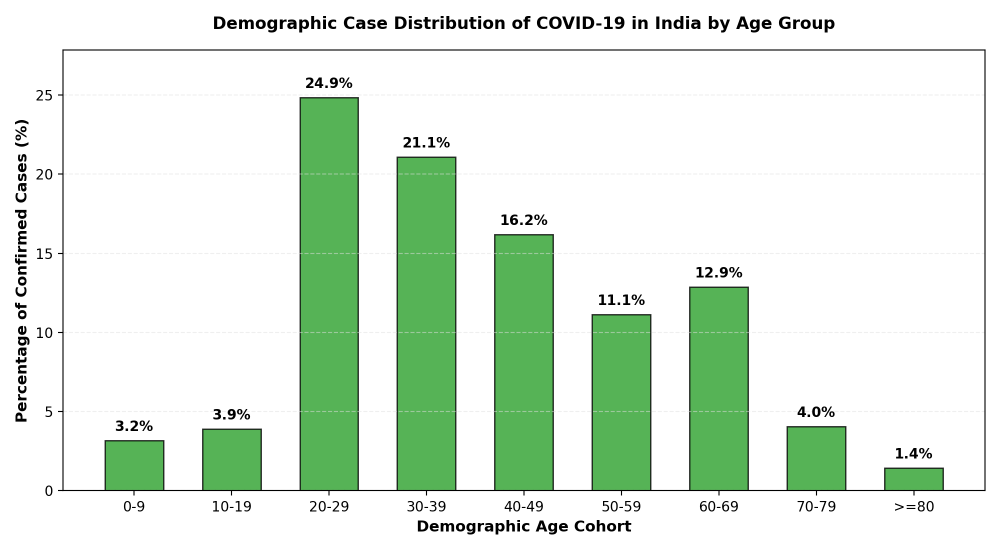
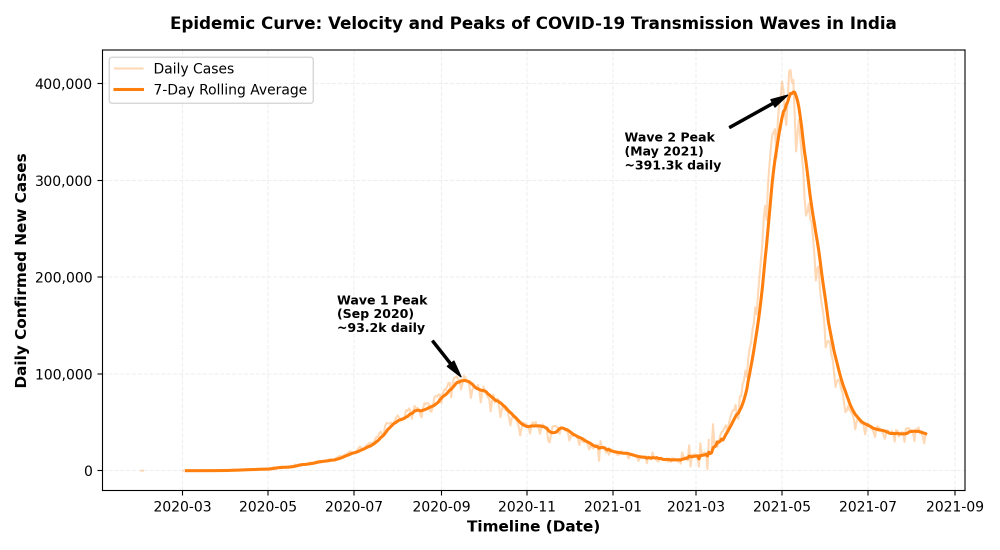

# COVID-19 India: Comprehensive Data Analysis & Trends

This project provides an in-depth, data-driven analysis of the COVID-19 pandemic's impact across India. Using a variety of data sources and advanced visualization libraries, this notebook tracks the spread, mortality, and recovery trends of the virus.

## 🚀 Key Features
- **Interactive Geospatial Visualizations**: Maps generated with `Folium` and `Plotly` to visualize regional impact.
- **Advanced Forecasting**: Utilizing the `Prophet` library for time-series prediction of confirmed cases and deaths.
- **Symptom Profiling**: Statistical breakdown of common COVID-19 symptoms.
- **Real-time Data Integration**: Scrapes current statistics from official health ministry sources.

## 📊 Visualization & Dashboard Showcase
*(Note: Interactive HTML maps and Plotly figures do not render on GitHub's static viewer. High-resolution static PNG renders of the key pipelines are embedded below for instant preview)*

### 📈 1. Cumulative Case Growth & Recovery Timeline

### 🗺️ 2. Top 10 Most Affected States

### 🔮 3. Predictive Case Forecasting (Meta Prophet Model)

### 📊 4. Daily Testing Volume vs. Confirmed Positive Case Rate

### 🧪 5. Diagnostic Test Positivity Rate (TPR) Trends

### 📉 6. Correlation Analysis: Case Fatality Rate vs. Recovery Rate

### 👥 7. Demographic Case Distribution by Age Cohort

### 🌊 8. Epidemic Curve: Transmission Velocity & Wave Peaks

## 🛠️ Technical Fixes for Colab
I have updated this notebook to ensure it works perfectly in **Google Colab** (Python 3.12+):
- **Library Updates**: Migrated from the deprecated `fbprophet` to the modern `prophet` package.
- **Dependency Management**: Added automated `pip install` commands for `pycountry` and `prophet`.
- **Environment Awareness**: Added checks to handle data paths gracefully outside of Kaggle.

## 📋 Tech Stack
- **Languages**: Python 3
- **Visualization**: Plotly, Folium, Seaborn, Matplotlib, Altair
- **Data Science**: Pandas, NumPy, Scipy
- **Prediction**: Prophet (Meta Open Source)
- **Scraping**: BeautifulSoup4, Requests

## 🧑‍💻 Author Note
**This project was completely done by me.** It represents a rigorous effort to synthesize complex epidemiological data into a professional analysis suite.

---
### How to Run
1. Click the **Open in Colab** badge at the top.
2. Ensure you have the required datasets available in the `/kaggle/input` path (or update the paths in the data loading section).
3. Run all cells to see the interactive analysis.
